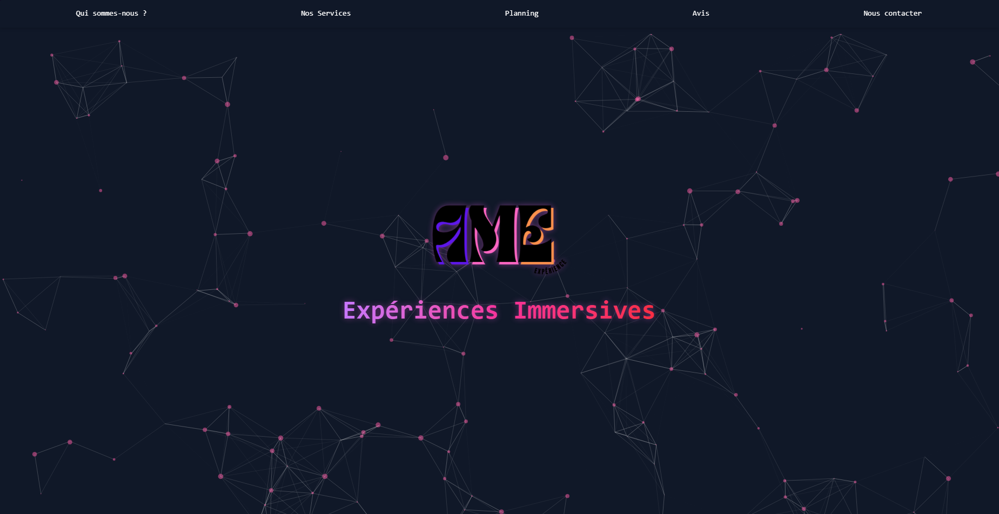
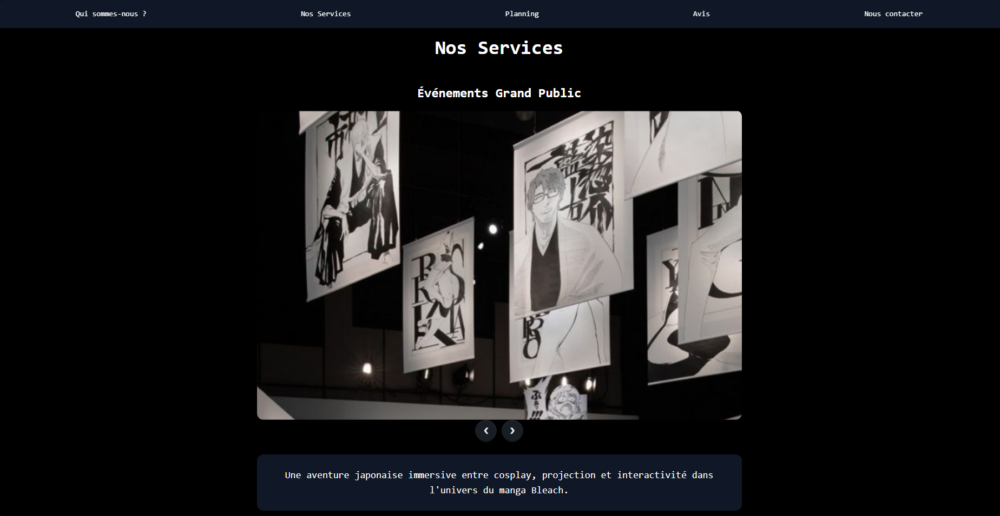
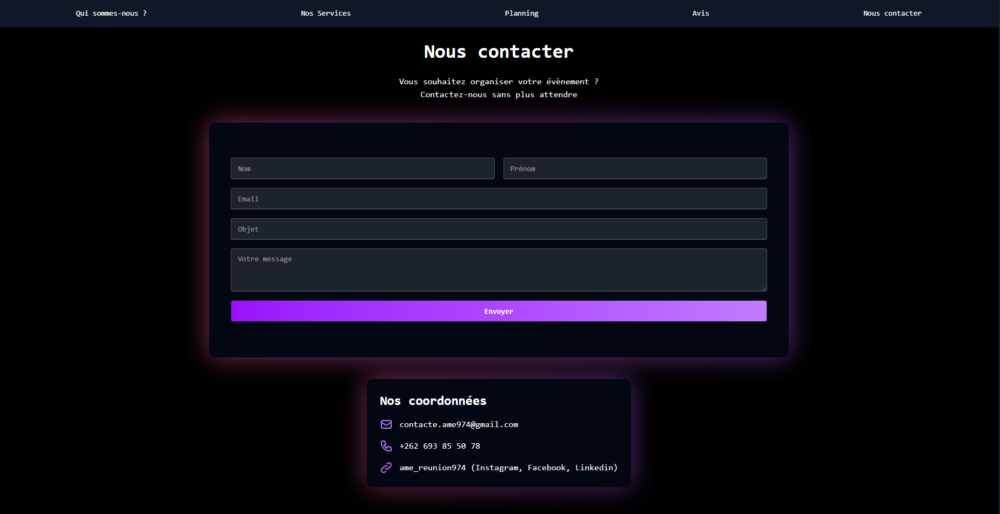

# ÂME – Site Vitrine d'Expériences Immersives

## Présentation
Ce projet est un **site vitrine responsive** développé pour présenter **ÂME**, une entreprise fictive spécialisée dans les **expériences et expositions immersives**.  
Le site a été réalisé dans le cadre d’un projet scolaire, avec l’objectif de proposer une **identité visuelle forte**, une **navigation fluide**, ainsi qu’une **mise en avant soignée des prestations** de l’entreprise.

Le site est actuellement **en ligne** :  
https://www.xn--me-experiences-cqb.fr  
*(Version internationale du domaine `âme-experiences.fr`)*

---

## Objectifs du site
- Présenter l’univers artistique et l’identité d’ÂME  
- Donner accès aux informations sur les expositions et prestations  
- Permettre aux utilisateurs de consulter un calendrier d’événements  
- Proposer une interface élégante, moderne et entièrement responsive  
- Faciliter la prise de contact via un formulaire fonctionnel

---

## Stack Technique

| Catégorie | Technologies utilisées |
|---------|-------------------------|
| **Framework Back-End** | Symfony |
| **Style & UI** | TailwindCSS, DaisyUI |
| **Effets & Animations** | tsParticles JS |
| **Interactions Front** | jQuery |
| **Carrousels / Sliders** | Glide JS, Swiper JS |
| **Gestion d’événements** | FullCalendar CSS |
| **Formulaire & Envoi d’e-mail** | PHPMailer |

---

## Fonctionnalités Principales
- Structure MVC avec Symfony
- Page d'accueil immersive avec animation interactive (tsParticles)
- Section de présentation et valeurs de l'entreprise
- Catalogue des expériences immersives
- Carrousels dynamiques (swiper / glide)
- Calendrier interactif des expositions
- Formulaire de contact fonctionnel avec envoi d’e-mail via PHPMailer
- Responsive design complet (mobile, tablette, desktop)

---

## Design & UX
Le design met l’accent sur :
- Des **ambiances atmosphériques** et immersives
- Une **typographie élégante**
- Une navigation **fluide et hiérarchisée**
- Une cohérence colorimétrique douce et immersive

La construction UI repose sur **DaisyUI** et **Tailwind**, permettant une mise en page modulable et facilement maintenable.

---

## Aperçu du projet

### Page d’accueil

### Section Nos Service

### Page Contact

---

## Auteur
**Keziah Perfillon**  
Développeur Web Fullstack – Montpellier  
Contact : keziahnoamperfillon@gmail.com  
Formation : Bachelor 2 Développeur Web – AFPAR
